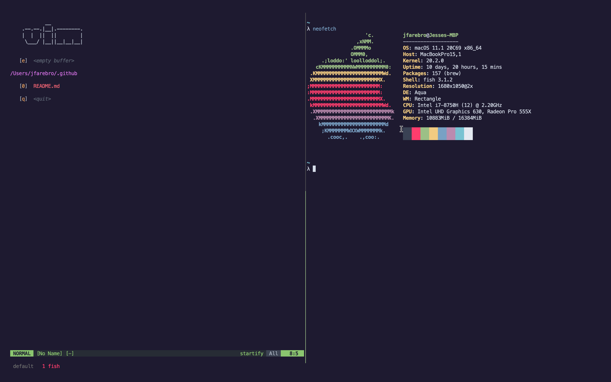

# dotfiles

<a href="#dotfiles">
  
</a>

# Installation

```sh
git clone --bare https://github.com/jessefarebro/dotfiles $HOME/.dotfiles
alias dotfiles="git --git-dir=$HOME/.dotfiles --work-tree=$HOME"

dotfiles checkout
dotfiles config status.showUntrackedFiles no

. ~/.config/fish/config.fish
```

